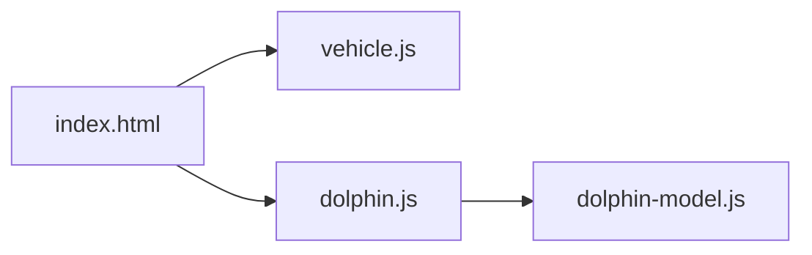

# Architecture

Transparent Three.js overlay on a static landing page, with a 3D dolphin driven by vehicle physics.

## Stack

- Vanilla HTML/CSS + ES modules via `importmap` (no build step)
- Three.js 0.170.0 from CDN (`cdn.jsdelivr.net`)
- No dependencies, no package.json

## Module graph

## Layers (in index.html)

1. **Landing page HTML/CSS** — static "Oceanic AI" demo page, dark theme
2. **Three.js canvas** — `position:fixed; pointer-events:none; z-index:9999` overlay
3. **Toggle button** — `z-index:10000`, top-left corner, enables/disables dolphin

## Rendering

- `WebGLRenderer` with `alpha: true` for transparent background
- `PerspectiveCamera` at Z=10 looking toward origin
- Frustum at Z=0: halfH ≈ 4.66, halfW ≈ 8.29 (16:9)
- Mouse NDC (-1..1) maps to world: `worldX = ndc.x * halfW`, `worldY = ndc.y * halfH`

## Data flow per frame

1. Mouse position → smoothed → behavior state machine picks nav target (NDC)
2. Nav target converted to world coords → fed to `vehicle.update(target, dt)`
3. Vehicle updates orientation quaternion + position via thrust/drag
4. `vehicle.applyTo(dolphinGroup)` sets position and quaternion
5. `animateDolphin(speed, dt)` runs segment-based swimming animation
6. Bubble particles update
7. `renderer.render(scene, camera)`
